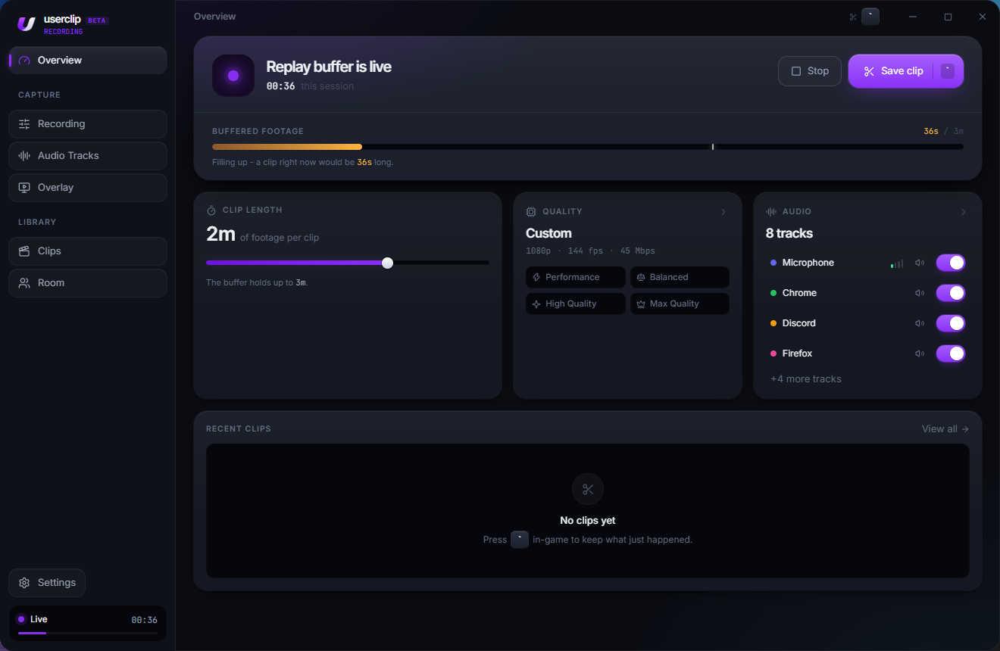
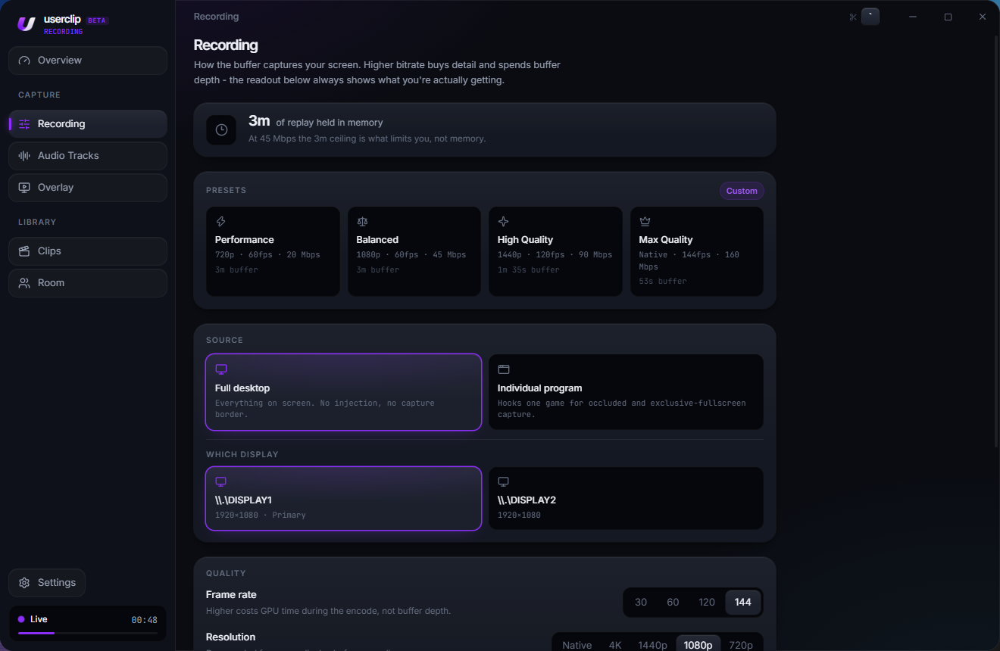
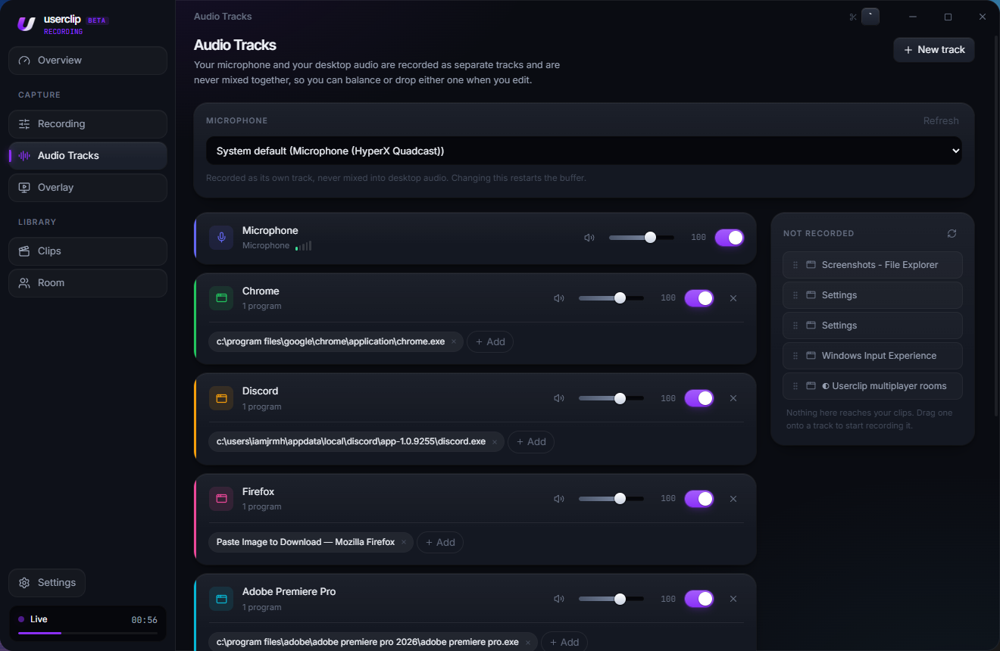
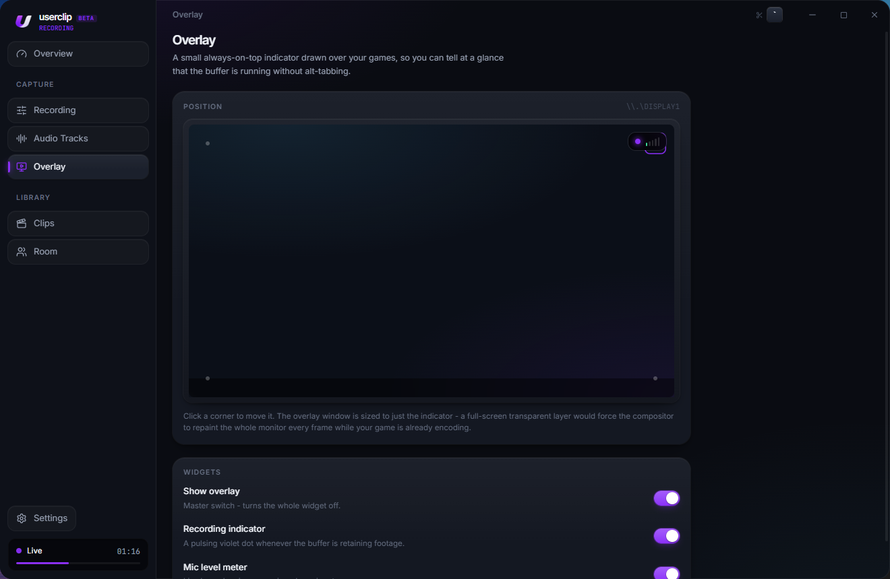
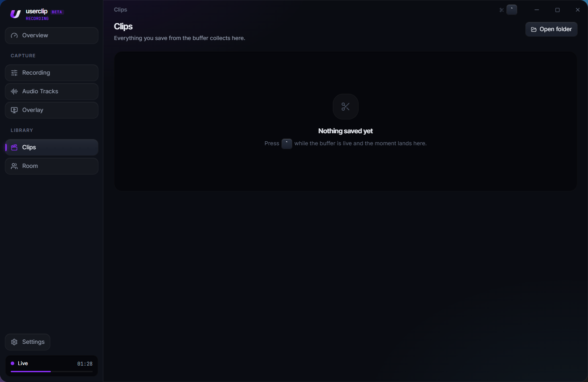
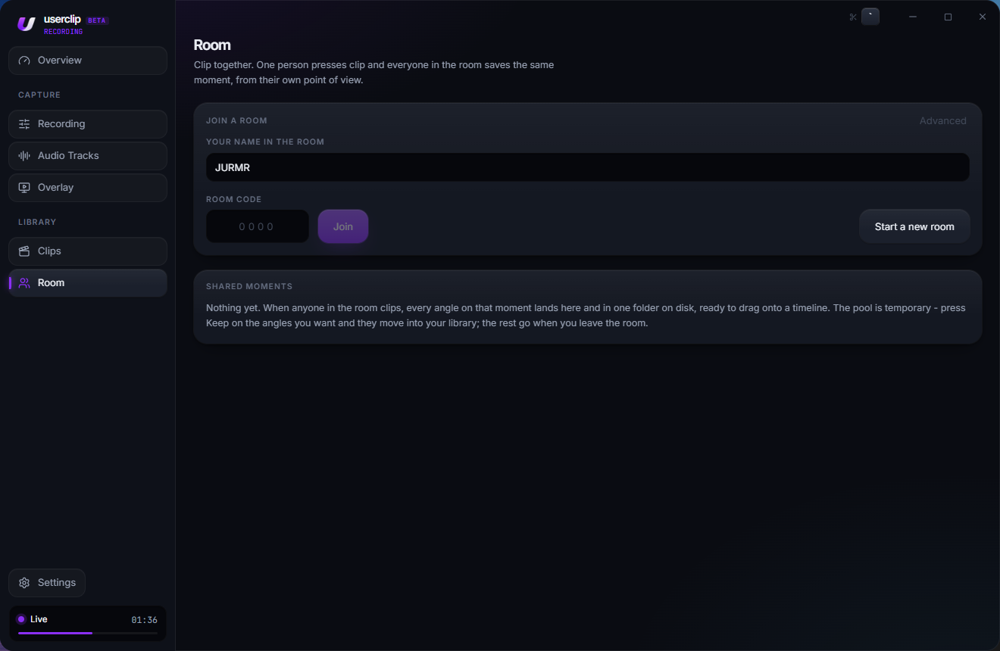

  

  <h1>userclip-beta by JURMR</h1>

Instant replay for your PC - the last few minutes of your screen are always in memory, so one hotkey saves the moment that already happened. Plus shared rooms, where one person presses clip and everyone in the room saves that same moment from their own point of view.

---

## ✨ What It Does

userclip keeps a rolling buffer of your screen in RAM at all times. You do not start a recording and you do not stop one. The buffer is simply always running, and when something worth keeping happens you press the hotkey and the last few minutes are written out. Nothing touches the disk until you actually save a clip.

- **Always recording, never recording** - the buffer lives entirely in memory. No rolling segment files filling a drive, and saving a clip never interrupts or restarts anything
- **The clip reaches the moment you pressed** - not "a few seconds after", which is the usual failure of replay tools. Measured at -57 ms with zero drift across a full session
- **Separate audio tracks, never mixed** - your microphone and your desktop audio are saved as their own labelled tracks. A mic baked into game audio can never be separated again, so userclip does not do it
- **Pick your microphone** - not whichever one Windows currently calls default, which on a machine with a headset, a webcam and a virtual cable is rarely the one you meant
- **Filed like ShadowPlay** - clips land in a per-game folder named from whatever game was in the foreground, as `<Game>\<Game> YYYY.MM.DD - HH.MM.SS.mkv`
- **Shared rooms** - up to 16 people on a 4-digit code. One person clips, everyone clips, and every angle on that moment ends up in one folder ready to drag onto a timeline
- **On-screen indicator** - an optional always-on-top overlay with a record light and mic level, in whichever corner you like
- **Stays out of the way** - closes to the tray with the buffer still running, and can start with Windows

---

## 🖥️ Screenshots

<h3 align="center">Overview</h3>

  

<h3 align="center">Recording</h3>

  

<h3 align="center">Audio Tracks</h3>

  

<h3 align="center">Overlay</h3>

  

<h3 align="center">Clips</h3>

  

<h3 align="center">Room</h3>

  

---

## 🧰 Requirements

- **Windows 10 or 11**
- **An NVIDIA GPU.** Capture is encoded with NVENC. AMD and Intel GPUs are not supported yet, and userclip tells you on the Recording screen if it cannot find NVENC
- **Enough RAM for the buffer.** The video ring is capped at 1 GiB, with raw audio held alongside it

---

## 📖 How to Use

1. **Run through setup once.** On first launch userclip asks for your display, quality, storage folder and clip hotkey. The buffer starts the moment setup finishes, and on every launch after that.
2. **Play.** The buffer fills in the background. The sidebar shows how far back it currently reaches.
3. **Press the hotkey** (default **Alt+F10**) when something happens. The clip is written from the buffer and appears under **Clips**.
4. **That is the whole loop.** There is no record button to remember.

### Clipping together

1. Everyone opens **Room** and enters a name.
2. One person presses **Start a new room** and reads out the 4-digit code. Everyone else types it in.
3. Check the roster. A green camera icon means that person's buffer is running and they can contribute an angle; grey means it is stopped and they would contribute nothing.
4. Anyone presses **Clip everyone**. Every machine in the room saves that same moment from its own point of view.
5. Angles appear under **Shared moments** and download in the background. All angles of one moment land in a single folder together.
6. **Press Keep on anything worth having before you leave.** The pool is temporary by design, as below.

---

## ⚙️ Settings

- **Overview** - buffer status, how far back it currently reaches, quality presets and per-track audio toggles inline
- **Recording** - display, resolution, frame rate, bitrate and container. Four presets from **Performance** (720p / 60fps / 20 Mbps) to **Max Quality** (native / 144fps / 160 Mbps), or set your own
- **Audio Tracks** - which microphone to record, and which sources are captured. Tracks are always kept separate
- **Overlay** - corner, record dot and mic level, shown on the display you are recording
- **Clips** - your saved clips, with playback, reveal in Explorer, and delete (to the Recycle Bin)
- **Room** - join or start a room, see who is in it, test your connection to each member, and manage shared moments
- **Settings** - clip hotkey, clip length, whether clips overlap, output folder, close to tray, and start with Windows

---

## 🧠 Things Worth Knowing

**How far back the buffer reaches depends on your bitrate.** The buffer is bounded by both three minutes and 1 GiB, and at high bitrates the byte budget runs out first. That is roughly three minutes at 45 Mbps but under a minute at 160 Mbps. userclip works this out and caps the clip length slider to match, so the number on screen is always one it can actually deliver.

**Shared clips do not outlive the room.** Everything in a moment's pool is removed when you leave, so a night of clipping with a full room does not quietly leave tens of gigabytes of other people's footage on your drive. Anything you press **Keep** on moves into your own library and stays. Removed files go to the Recycle Bin, not straight to nothing.

**Clips from a room line up on a timeline.** Every machine syncs its clock against the room, and each angle records exactly where its first frame sits relative to the agreed moment. Without that, one person's PC clock being a third of a second off would misalign their entire angle.

**Your footage goes straight to the people in your room.** Clips transfer peer to peer. The room server only introduces people to each other and agrees on when the moment happened. It never receives, stores or forwards a single frame.

---

## 🐛 Troubleshooting

**Clips are a single frozen frame, or only a few milliseconds long**
The buffer stopped advancing at some point, usually after a display mode change or a GPU driver reset. userclip recovers from those on its own and refuses to write a stale clip, telling you how far behind the buffer is instead. If you do see it, stop and start the buffer from **Overview**.

**"Could not start desktop capture"**
Desktop Duplication was not available for the selected display. Pick a different display in **Recording**, and if you have multiple GPUs make sure the display is attached to the NVIDIA one.

**The clip length slider will not go as high as I want**
It is capped to what the buffer can actually hold at your current bitrate. Lower the bitrate in **Recording** and the ceiling rises.

**A room member shows a grey camera icon**
Their buffer is not running, so they would contribute nothing to a shared clip. They need to start it from **Overview**.

**A shared angle is stuck downloading, or failed**
Use **Test connection** in the Room screen. It dials each member directly and reports whether they are reachable, and failures name a reason. To dig further, the **Log** button opens the folder containing `room.log`.

**My shared clips disappeared**
The pool does not survive leaving a room. Anything not pressed **Keep** on is removed, to the Recycle Bin.

---

## 📥 Installation

userclip is a Windows desktop app. ffmpeg is bundled, so there is nothing else to install.

1. Go to the **[Releases](../../releases)** page and download either the `.msi` or the `.exe` (NSIS) installer from the **[latest release](../../releases/latest)**.
2. Run the installer and follow the prompts.
3. Launch **userclip** from your Start Menu or Desktop.
4. Follow [How to Use](#-how-to-use) above.

> This repository hosts releases only. userclip is closed source, so there is no source to check out here.

---

## 💬 Support

Found a bug, or something not behaving the way this README says it should? [Open an issue](../../issues) with what you were doing and what happened instead. For anything room related, `room.log` (the **Log** button in the Room screen) is the most useful thing you can attach.

For anything else - questions, feature ideas, or just want to say hi - message **iamjrmh** on Discord, or drop into the server:

**[discord.gg/KJYPjnzd7C](https://discord.gg/KJYPjnzd7C)**

---

## 🎮 Related Projects

- [CHQueue](https://github.com/iamjrmh/CHQueue) - TikTok LIVE song-request queue for Clone Hero, also by JURMR
- [CHSuite](https://github.com/iamjrmh/CHSuite) - All-in-one Clone Hero toolkit, also by JURMR

---

Made with 🎬 by JURMR
